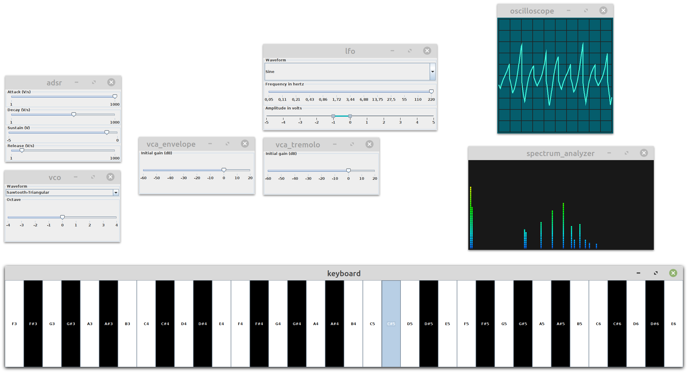

# Bragi

Bragi is a modular, real-time, sound synthesizer written in Java. It is still in progress and only has a rudimentary
user interface. Following modules are provided:
* **ADSR**: envelope generator with Attack, Decay, Sustain and Release parameters
* **LFO**: Low Frequency Oscillator
* **VCO**: Voltage Controlled Oscillator
* **VCA**: Voltage Controlled Amplifier
* **VCF**: Voltage Controlled Filter (with low-pass or high-pass response)
* **Keyboard**: a basic keyboard based on computer keyboard (from F3 to E6)
* **Oscilloscope**: basic oscilloscope
* **SpectrumAnalyzer**: basic spectrum analyzer
* **Mp3Player**: basic MP3 file player
* **WavPlayer**: basic WAV file player
* **WhiteNoiseGenerator**: white noise generator
* **PinkNoiseGenerator**: pink noise generator
* **Theremin**: some kind of theremin (with just pitch and volume, not the incredible timbre of the real instrument)
* **Sampler**: an experimentation to change the sample rate or sample size
* **Ditherer**: an experimentation with dithering
* **Speaker**: a module connected to your speakers
* **Microphone**: a module connected to your microphone
## Getting Started
These instructions will get you a copy of the project up and running on your local machine
for development and testing purposes.
### Prerequisites
* Java 14 (depending on your IDE, you may have to add the JVM option `--enable-preview`)
* Maven 3.6.1
* Git 2.17.1
### Installing
* Clone the repository from github.com:
```
git clone git@github.com:Achaaab/Bragi.git
```
* Import the project Bragi in your IDE.
* Run the main class `com.github.achaaab.bragi.Test`.
## Examples
### MP3Player connected to Speaker
```java
var player = new Mp3Player(TEST_MP3_PATH);
var speaker = new Speaker();

player.connectOutputs(speaker);

// optional part: spectrogram with fancy effects
var spectrum = new SpectrumAnalyzer();
player.connect(spectrum);
```
### Tremolo
```java
var adsr = new ADSR();
var keyboard = new Keyboard();
var vco = new VCO();
var vcaEnvelope = new VCA("vca_envelope");
var speaker = new Speaker();
var lfo = new LFO();
var vcaTremolo = new VCA("vca_tremolo");

// main chain
keyboard.connect(vco);
vco.connect(vcaEnvelope);
vcaEnvelope.connect(vcaTremolo);
speaker.connectInputs(vcaTremolo, vcaTremolo);

// ADSR + tremolo
keyboard.getGate().connect(adsr.getGate());
adsr.connect(vcaEnvelope.getGain());
lfo.connect(vcaTremolo.getGain());

// some tuning
vco.setWaveform(SAWTOOTH_TRIANGULAR);
adsr.setAttack(1000.0);
adsr.setRelease(2.0);

// visualization
var oscilloscope = new Oscilloscope();
var spectrum = new SpectrumAnalyzer();
vcaTremolo.connect(oscilloscope, spectrum);
```
## Built With
* [IntelliJ IDEA](https://www.jetbrains.com/idea/) - Integrated Development Environment
* [OpenJDK](https://jdk.java.net/) - Java Development Kit
* [Maven](https://maven.apache.org/) - Dependency and build management
* [OpenJFX](https://openjfx.io/) - Application platform
* [JLayer](http://www.javazoom.net) - MP3 decoder
* [Log4j](https://logging.apache.org/log4j) - Logging API
* [git](https://git-scm.com/) - Version control system
* [GitHub](https://github.com/) - Project management
## Contributing
I am still developing Bragi but feel free to submit pull requests.
## Authors
* **Jonathan Guéhenneux** - *Developer* - [Achaaab](https://github.com/Achaaab)
## License
This project is licensed under the GNU General Public License (GPL) - see the [LICENSE.md](LICENSE.md) for the details.
## Acknowledgments
* Thanks to [Damien Di Fede](https://github.com/ddf) for his FFT implementation
* Thanks to [Ernest Yu](https://github.com/ernieyu)
for his [range slider](https://github.com/ernieyu/Swing-range-slider) Swing implementation